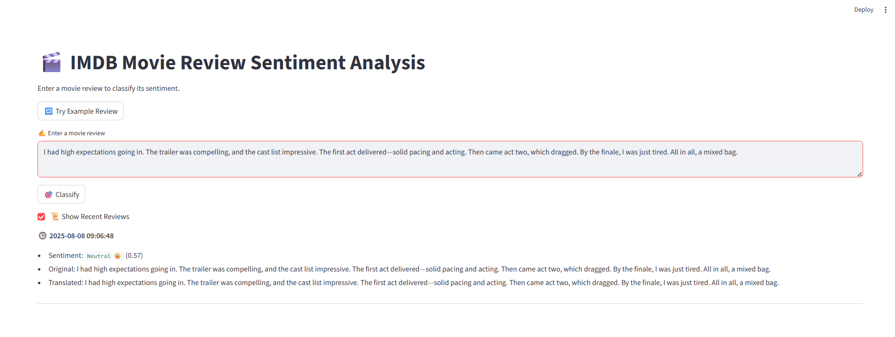

# 🎬 IMDB Sentiment Analysis App

A smart and intuitive web application for analyzing the sentiment of movie reviews. Built using **Python**, powered by a trained **RNN (Recurrent Neural Network)** model, and served via an elegant **Streamlit** interface. It supports multilingual input, translates to English automatically, and logs each prediction to a local **SQLite** database.

---

## 🛠 Tech Stack

<p align="left">
  
  
  
  
  
  
</p>

---

## ✨ Features

- 🔍 Analyze any movie review text
- 🌐 Automatically translates non-English input to English
- 🧠 Predicts sentiment: **Positive**, **Negative**, or **Neutral**
- 🗂️ Stores all reviews, translations, predictions, and scores in a local database
- 📋 View recent predictions directly within the app
- 🖥️ Clean and responsive UI with **Streamlit**

---

## 📁 Project Structure
```commandline
imdb_sentiment-app/
│
├── .gitignore                # Git ignore rules for Python, IDEs, etc.
├── README.md                 # Project documentation
├── requirements.txt          # List of Python dependencies
├── main.py                   # Main Streamlit app entry point
│
├── assets/                   # Static assets like images
│   └── app_screenshot.png    # Screenshot of the app UI
│
├── data/                     # Persistent data storage
│   └── IMDb_Sentiment.db     # SQLite database (auto-generated)
│
├── model/                    # Pre-trained model directory
│   └── simple_rnn_imdb.h5    # RNN model for sentiment analysis
│
├── notebooks/                # Jupyter notebooks for experiments/training
│   ├── Experiments.ipynb     
│   └── Predication.ipynb     
│
├── utils/                    # Utility Python scripts
│   └── db.py                 # Database interaction logic
│
└── .venv/                    # Virtual environment (ignored by Git)
```
---

## 💻 How to Run This Project

### 1. Clone the Repository

```Bash
git clone https://github.com/dk-ml-dev/imdb-sentiment-app.git
cd imdb-sentiment-app
```
### 2. Create a Virtual Environment (optional but recommended)

```Bash
python -m venv .venv
```
- ###  On macOS/Linux
```Bash
source .venv/bin/activate 
```
- ### On Window
```Bash
.venv\Scripts\activate
```

### 3. Install Dependencies
```Bash
pip install -r requirements.txt
```
### 4. Run the Application
```Bash
streamlit run main.py
```
---
## 
---

## 📸 App Screenshot

Here’s how the app looks when running in your browser:

<p align="center">
  
</p>


---
## 🚀 Future Enhancements

- 📊 Visualize sentiment trends over time
- 📁 Batch processing via CSV uploads
- ☁️ Deploy via Streamlit Cloud or Docker
- 🔐 Add authentication and personalized review history


---

## 📜 License

This project is licensed under the MIT License.
You're free to use, modify, and share it.


---

## 👤 Author

@dk-ml-dev
Connect with me on GitHub or contribute to this repository.

> Built with ❤️ for learning, experimentation, and real-world application.

---

